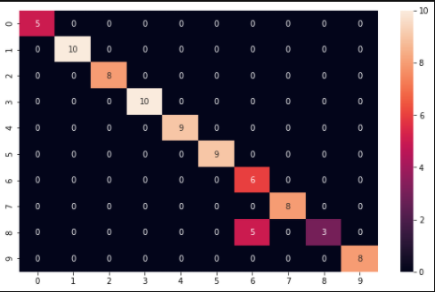

# Wizja-Nauka
Ćwiczenia wykonywane w celu przyswojenia koncepcji wizji komputerowej.

1. Stworzenie funkcji wyświetlającej obrazy w postaci macierzy z odpowiednimi tytułami.

 

2. Stworzenie funkcji pozwalającej na modyfikację histogramu, zwężanie i poszerzanie. Dodatkowo implementacja kilku prostych metod automatycznego doboru szerokości histogramu.

 

3. Stworzenie funkcji wyświetlającej sparametryzowaną piramidę Gaussa.

 

4. Analiza ruchu oraz koloru w czasie rzeczywistym.

   https://youtu.be/J9H9F2ZoKbU

5. Klasyfikacja ciągów znaków.

   Wykonana na dwa sposoby, przy pomocy prostych drzew decyzyjnych oraz przy pomocy wytrenowanej sieci CNN. Głównym wyzwaniem była mała liczba danych uczących, dlatego do nauczenia sieci CNN użyto augmentacji danych.

     

